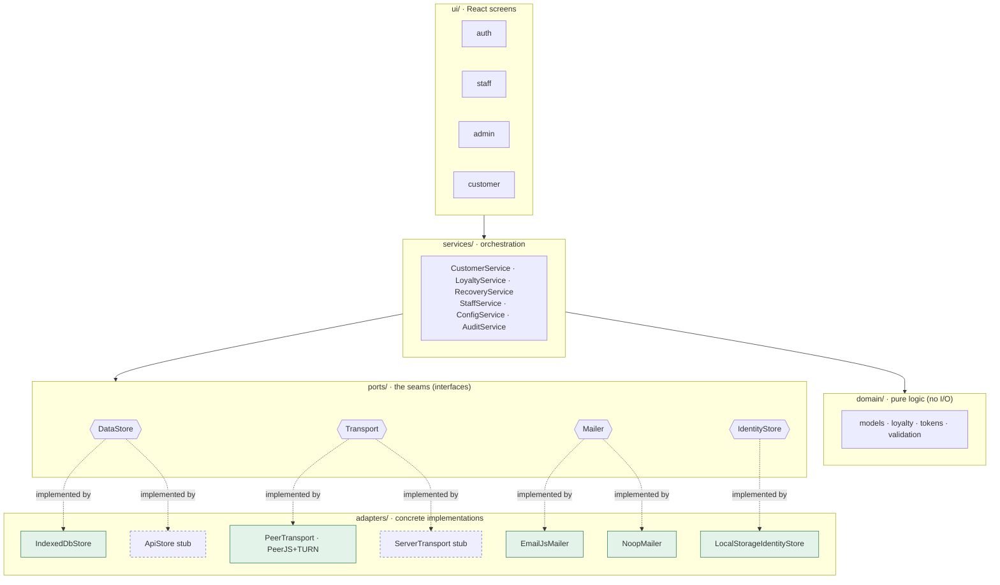
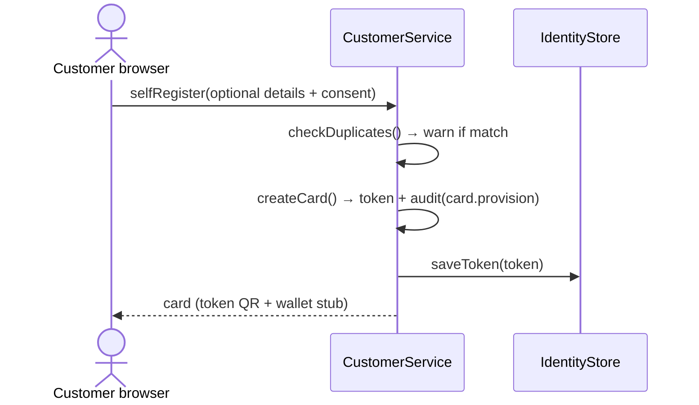
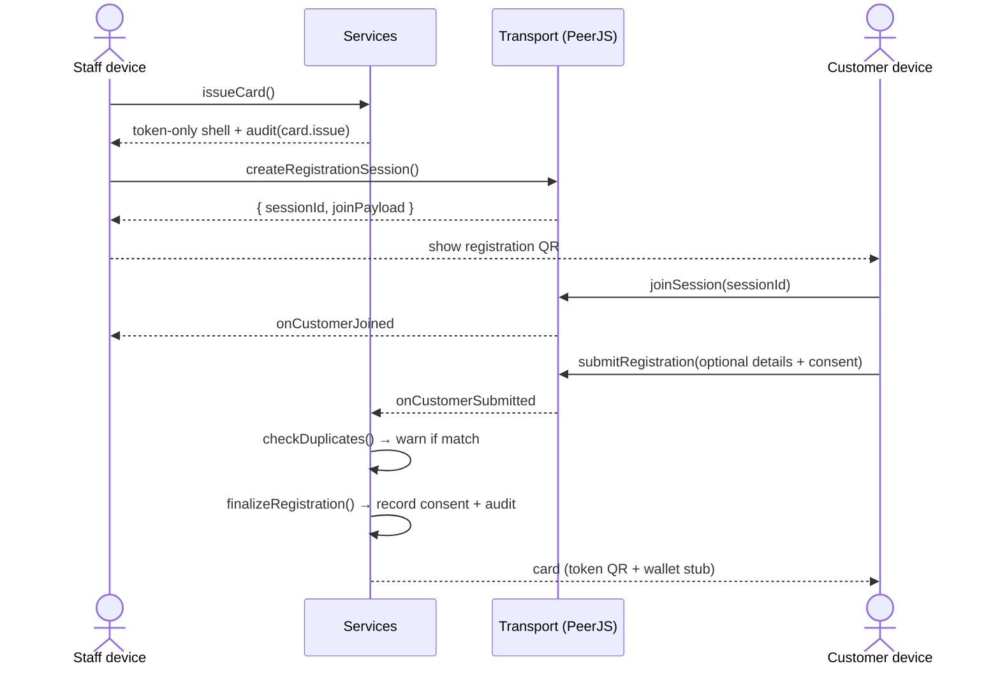
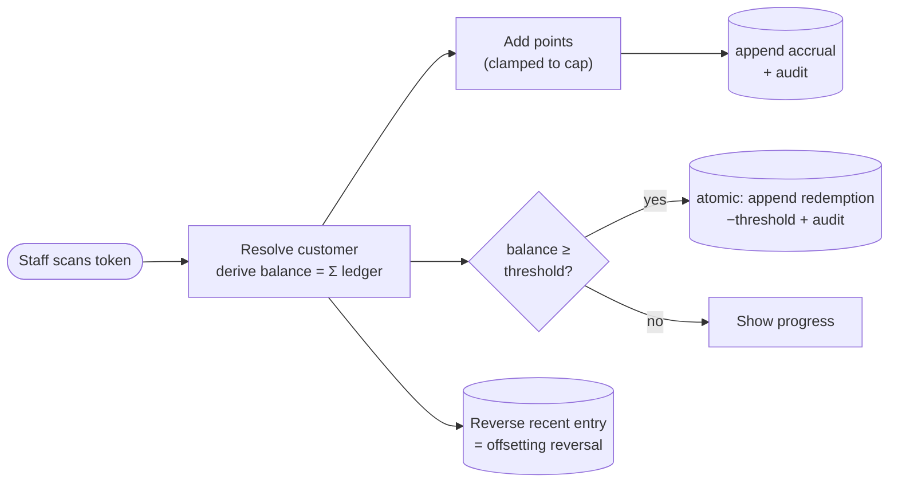
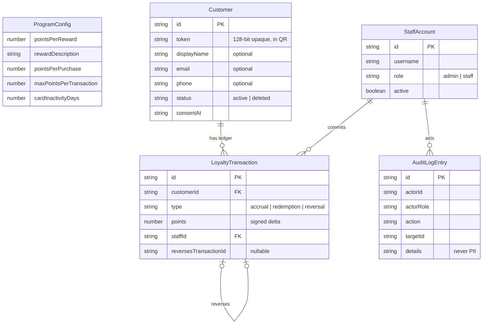
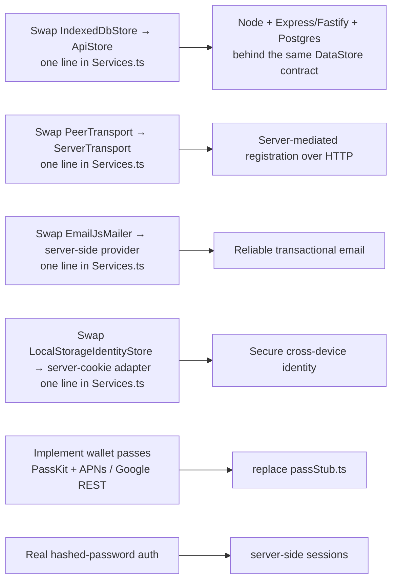

# ☕ Café Loyalty — v1 prototype

A digital loyalty system for a **single café**. Staff scan a customer's QR and
commit loyalty points; customers collect points and earn rewards. **The system
never handles money** — it only tracks loyalty state.

This repo is the **v1 functional prototype**: a React + TypeScript SPA with
browser storage, deployed to GitHub Pages. Its architecture is **true to the
production design**, so going live means swapping pluggable adapters — not a
rewrite. Authoritative requirements live in [`docs/SPEC.md`](docs/SPEC.md);
working rules for agents in [`CLAUDE.md`](CLAUDE.md); current build status in
[`docs/STATUS.md`](docs/STATUS.md).

> ⚠️ **Prototype only.** Browser storage is **not** secure storage. Do not enter
> real customer data.

**Live demo:** https://misch0n.github.io/loyalty-system/ · Demo logins:
`admin / admin` or `staff / staff`.

---

## Table of contents
- [What it does](#what-it-does)
- [Feature set](#feature-set)
- [Architecture](#architecture)
- [Core flows](#core-flows)
- [Data model](#data-model)
- [Project layout](#project-layout)
- [The pluggable seams](#the-pluggable-seams)
- [Running it](#running-it)
- [Path to production](#path-to-production)

---

## What it does

The trust anchor is **staff-side**: only staff can commit points or redemptions,
because staff presence confirms a real transaction happened. Customers can only
*display* their card. Identity is a **random 128-bit opaque token** (in the QR) —
never derived from name/phone — so a screenshotted card leaks no personal data.
Personal details are **optional**; a fully anonymous (token-only) account is
valid.

Points live in an **append-only ledger**. Balance and "reward available" are
*derived* by summing entries — never stored as a counter. Corrections are
`reversal` entries, never destructive edits. Every staff/admin action writes an
**audit entry**.

---

## Feature set

| Area | Capabilities |
|---|---|
| **Auth (mock)** | Staff/admin login with role gating. Disabling a departed employee instantly revokes access. |
| **Self-service registration** | PRIMARY path: customer visits `/register`, creates their own card in one step — remembered on the browser via `IdentityStore`. No approval queue, no staff involvement. |
| **Staff-initiated registration** | SECONDARY path: staff start a card at `/staff/issue` over real PeerJS; customer joins on their own device. Duplicate details **warn before** a second card is created. |
| **Auto-provision on scan** | Scanning an unknown-but-valid token creates a token-only card on the staff device so accrual can proceed immediately. Staff still initiates the credit. |
| **Loyalty accrual** | Staff scan → see customer state → add points (default `pointsPerPurchase`, **capped** at `maxPointsPerTransaction`). Appends an `accrual` + audit entry. Sends a best-effort reward-available email on threshold crossing (when customer has an email). |
| **Redemption** | Staff redeem when balance ≥ threshold. **Atomic** check-and-write — no double-spend. |
| **Self-service recovery** | Customer visits `/recover`, enters their registered email → single-use link (15-min expiry) via EmailJS → opening the link re-establishes identity on the browser. Token-only customers remain unrecoverable by design (disclosed at signup). Uniform response (no account enumeration). |
| **Staff recovery / reissue** | `/staff/find`: find customer by name/email/phone; reissue with a **rotated token** (default) or keep it. Backup path. |
| **Correction / undo** | Reverse a recent accrual/redemption via an offsetting `reversal` entry — logged, never silent. |
| **Deletion / opt-out** | Staff-confirmed soft delete: status → `deleted`, PII cleared, audited. Honors right to erasure. |
| **Admin — staff** | List / create / disable / re-enable / reset password. |
| **Admin — program** | Edit threshold, reward text, points-per-purchase, per-transaction cap, inactivity days. |
| **Admin — stats** | Basic counts: active customers, points issued, rewards redeemed. |
| **Admin — audit log** | Filterable, append-only action trail (no PII). |
| **Backup** | JSON export/import (behind the same `DataStore` port). |
| **Wallet (stub)** | Apple Wallet: static `.pkpass` QR-holder (no developer account; web page is the iOS status surface). Google Wallet: dynamic loyalty pass via REST. Both stubbed in `wallet/passStub.ts`; real passes need the backend. |
| **Base-URL landing** | `/` routes by context: authenticated staff/admin → staff home; recognized browser → `/status/:token`; otherwise → landing with Join / Lost-my-card / Staff sign-in. Staff/admin session always takes precedence (never auto-shows a customer card). |

---

## Architecture

Layered **ports & adapters (hexagonal)**. Dependencies point **inward**: the UI
talks only to services; services orchestrate the pure domain against interfaces
(ports); concrete adapters plug into those ports at one composition root.



**Rules that keep the swap cheap:**
- `domain/` is pure — no I/O, no React, no browser APIs → fully unit-testable and
  shared verbatim with the future Node backend.
- `DataStore` is **async everywhere** (returns Promises), even though IndexedDB
  could be sync, so call sites match the future HTTP adapter byte-for-byte.
- The **composition root** ([`src/services/Services.ts`](src/services/Services.ts))
  is the *only* place that names a concrete adapter.
- The UI **never** touches an adapter or storage directly.

---

## Core flows

### Self-service registration (primary path)

The customer creates their own card without staff involvement. `IdentityStore`
persists the token in the browser so subsequent visits skip registration.



### Staff-initiated registration (secondary path)

Staff and customer devices communicate over **PeerJS + TURN** (real two-device
connection; no single-browser simulation).



### Accrual & redemption (append-only ledger)



---

## Data model

Append-only ledger + audit log. `Customer.token` is the opaque identity; PII is
optional. Balance and reward-availability are derived, never stored.



---

## Project layout

```
src/
├── config/
│   ├── env.ts             # feature flags (VITE_TRANSPORT, VITE_EMAILJS_*, VITE_TURN_*), baseUrl, iceServers
│   └── links.ts           # appUrl() — builds absolute HashRouter URLs for QR + emails
├── domain/                # pure logic, fully unit-tested
│   ├── models.ts          # entity types (incl. card.provision, customer.recover audit actions)
│   ├── loyalty.ts         # balance, reward-availability, redemption rules
│   ├── tokens.ts          # 128-bit opaque token generation
│   └── validation.ts      # input + duplicate checks
├── ports/                 # the seams (interfaces)
│   ├── DataStore.ts       # includes createRecoveryCode / consumeRecoveryCode
│   ├── Transport.ts
│   ├── Mailer.ts          # NEW — email abstraction
│   └── IdentityStore.ts   # NEW — browser identity (token storage)
├── adapters/
│   ├── storage/
│   │   ├── IndexedDbStore.ts   # prototype storage (schema v2, recoveryCodes store)
│   │   ├── ApiStore.ts         # production HTTP stub
│   │   └── schema.ts           # IndexedDB schema + seed data
│   ├── transport/
│   │   ├── PeerTransport.ts    # prototype: PeerJS + TURN (real cross-device)
│   │   └── ServerTransport.ts  # production placeholder (throws)
│   ├── email/
│   │   ├── EmailJsMailer.ts    # client-side EmailJS via fetch
│   │   └── NoopMailer.ts       # fallback when EmailJS unconfigured
│   └── identity/
│       └── LocalStorageIdentityStore.ts   # stores token only (no PII)
├── services/              # orchestrate domain + ports
│   ├── CustomerService.ts · LoyaltyService.ts · StaffService.ts
│   ├── ConfigService.ts · AuditService.ts
│   ├── RecoveryService.ts # NEW — self-service recovery (single-use expiring codes)
│   └── Services.ts        # ← composition root (only place naming adapters)
├── qr/                    # encode (payloads) + scan (camera wrapper)
├── wallet/                # passStub.ts + production integration notes
└── ui/
    ├── auth/ · staff/ · admin/
    ├── customer/          # CustomerHome · SelfRegister · Recover · Status · …
    └── common/            # QrDisplay, QrScanner, Layout, contexts, guards
tests/                     # Vitest: domain, service, adapter, qr, wallet, config (166 passing)
.env.example               # documents required build-time secrets
.github/workflows/deploy.yml   # build + test + deploy (injects secrets at build time)
```

---

## The pluggable seams

| Seam | Prototype adapter | Production adapter | Swap cost |
|---|---|---|---|
| **`DataStore`** (persistence) | `IndexedDbStore` | `ApiStore` → Node + Postgres | One line in `Services.ts` |
| **`Transport`** (registration handoff) | `PeerTransport` (PeerJS + TURN) | `ServerTransport` (server-mediated) | One line in `Services.ts` |
| **`Mailer`** (email) | `EmailJsMailer` (client-side EmailJS) or `NoopMailer` | Server-side provider | One line in `Services.ts` |
| **`IdentityStore`** (browser identity) | `LocalStorageIdentityStore` | Server-cookie adapter | One line in `Services.ts` |

### Prototype transport
`adapters/transport/PeerTransport.ts` uses PeerJS with a Metered TURN relay for
real two-device connectivity. Selected when `VITE_TRANSPORT=peer` (the default).
TURN credentials and EmailJS keys are **build-time-injected demo secrets** —
publicly readable in the static bundle, rotated after demos. See `.env.example`
for the full list. `adapters/transport/ServerTransport.ts` is the production
placeholder (every method throws until the backend exists).

---

## Running it

```bash
npm install
npm run dev        # http://localhost:5173
npm test           # 166 unit tests (Vitest)
npm run build      # static output in dist/
npm run typecheck  # strict TS, no emit
```

Copy `.env.example` to `.env.local` and fill in your credentials before running
locally (TURN + EmailJS). `.env.local` is gitignored.

**Two-device demo:** PeerJS transport is the default. Open `http://localhost:5173`
on two devices on the same network (or use the deployed Pages URL), then scan the
registration QR from the customer device.

Staff and admin logins: `admin / admin` or `staff / staff`.

### Deployment
Pushing to `main` runs [`.github/workflows/deploy.yml`](.github/workflows/deploy.yml):
it installs, **runs tests**, builds with the Pages base path (`/loyalty-system/`),
injects `VITE_EMAILJS_*` and `VITE_TURN_*` secrets from GitHub repository secrets
into the static bundle, and publishes to GitHub Pages. Routing uses `HashRouter`,
so no server rewrites are needed (a `public/404.html` fallback is shipped as a
belt-and-braces). `VITE_TRANSPORT` defaults to `peer`, so the deployed build uses
PeerJS on real devices.

> Pages source must be set to **GitHub Actions** (Settings → Pages → Source).
> Secrets must be added under Settings → Secrets → Actions before the first deploy.

---

## Path to production

Bounded and mechanical (see [SPEC §14](docs/SPEC.md)):



Because every app call already goes through async ports, **no UI or service call
site changes**. `domain/` and `ports/` move/share into the backend unchanged.
