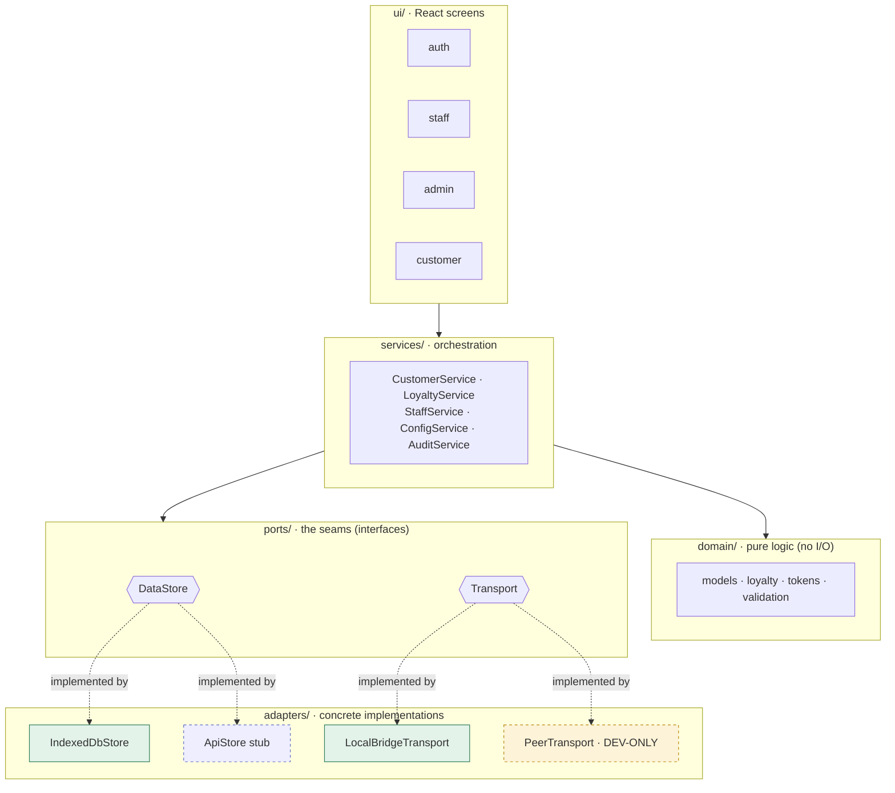
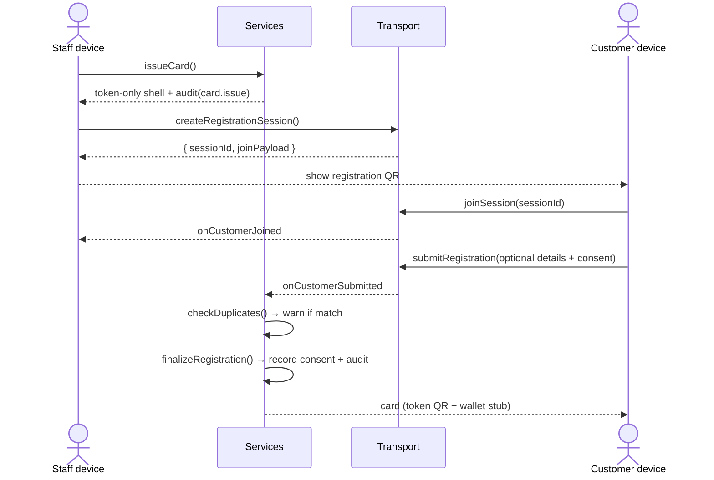
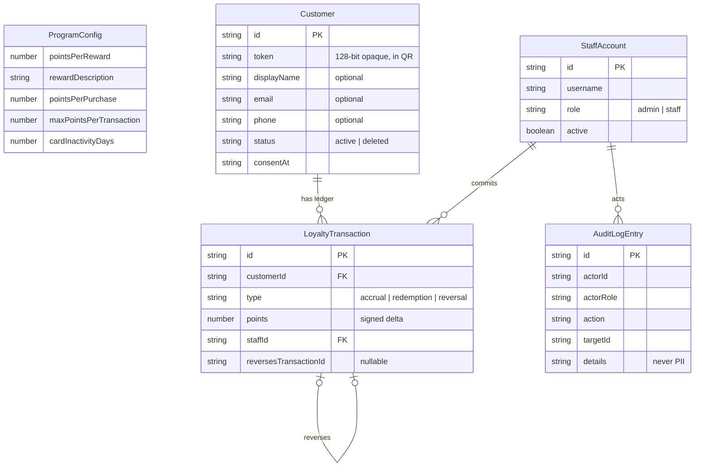
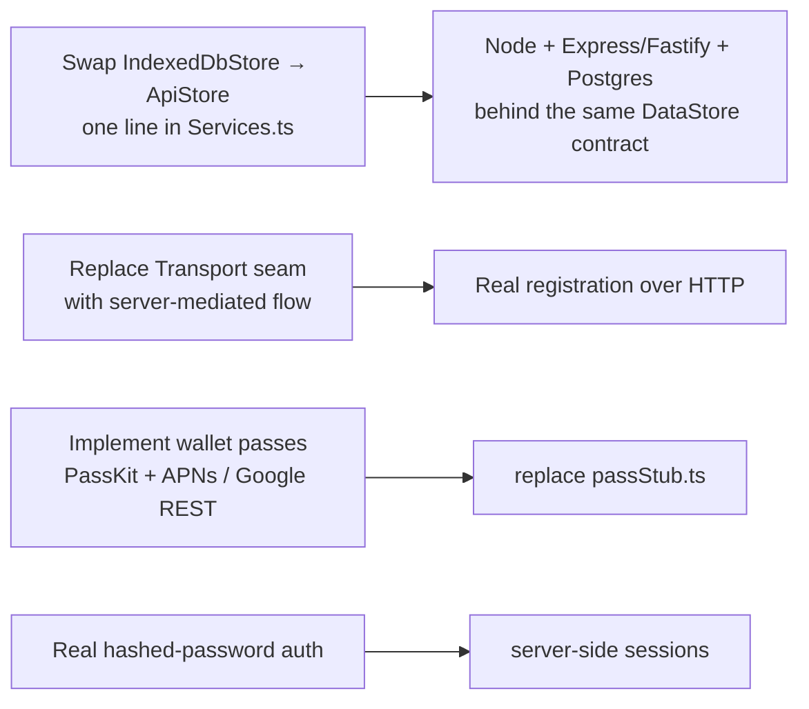

# ☕ Café Loyalty — v1 prototype

A digital loyalty system for a **single café**. Staff scan a customer's QR and
commit loyalty points; customers collect points and earn rewards. **The system
never handles money** — it only tracks loyalty state.

This repo is the **v1 functional prototype**: a React + TypeScript SPA with
browser storage, deployed to GitHub Pages. Its architecture is **true to the
production design**, so going live means swapping pluggable adapters — not a
rewrite. Authoritative requirements live in [`docs/SPEC.md`](docs/SPEC.md);
working rules for agents in [`CLAUDE.md`](CLAUDE.md); current build status in
[`docs/STATUS.md`](docs/STATUS.md).

> ⚠️ **Prototype only.** Browser storage is **not** secure storage. Do not enter
> real customer data.

**Live demo:** https://misch0n.github.io/loyalty-system/ · Demo logins:
`admin / admin` or `staff / staff`.

---

## Table of contents
- [What it does](#what-it-does)
- [Feature set](#feature-set)
- [Architecture](#architecture)
- [Core flows](#core-flows)
- [Data model](#data-model)
- [Project layout](#project-layout)
- [The two pluggable seams](#the-two-pluggable-seams)
- [Running it](#running-it)
- [Path to production](#path-to-production)

---

## What it does

The trust anchor is **staff-side**: only staff can commit points or redemptions,
because staff presence confirms a real transaction happened. Customers can only
*display* their card. Identity is a **random 128-bit opaque token** (in the QR) —
never derived from name/phone — so a screenshotted card leaks no personal data.
Personal details are **optional**; a fully anonymous (token-only) account is
valid.

Points live in an **append-only ledger**. Balance and "reward available" are
*derived* by summing entries — never stored as a counter. Corrections are
`reversal` entries, never destructive edits. Every staff/admin action writes an
**audit entry**.

---

## Feature set

| Area | Capabilities |
|---|---|
| **Auth (mock)** | Staff/admin login with role gating. Disabling a departed employee instantly revokes access. |
| **Issue card** | Staff start a card → token-only shell + registration session. Customer joins, enters **optional** details, reads the privacy notice, consents, submits. Duplicate details **warn before** a second card is created. |
| **Loyalty accrual** | Staff scan → see customer state → add points (default `pointsPerPurchase`, **capped** at `maxPointsPerTransaction`). Appends an `accrual` + audit entry. |
| **Redemption** | Staff redeem when balance ≥ threshold. **Atomic** check-and-write — no double-spend. |
| **Recovery / reissue** | Find a customer by name/email/phone; reissue with a **rotated token** (default) or keep it. Token-only customers can't be recovered (disclosed at signup). |
| **Correction / undo** | Reverse a recent accrual/redemption via an offsetting `reversal` entry — logged, never silent. |
| **Deletion / opt-out** | Staff-confirmed soft delete: status → `deleted`, PII cleared, audited. Honors right to erasure. |
| **Admin — staff** | List / create / disable / re-enable / reset password. |
| **Admin — program** | Edit threshold, reward text, points-per-purchase, per-transaction cap, inactivity days. |
| **Admin — stats** | Basic counts: active customers, points issued, rewards redeemed. |
| **Admin — audit log** | Filterable, append-only action trail (no PII). |
| **Backup** | JSON export/import (behind the same `DataStore` port). |
| **Wallet (stub)** | "Add to Apple/Google Wallet" visibly present in-flow; real passes need the backend. |

---

## Architecture

Layered **ports & adapters (hexagonal)**. Dependencies point **inward**: the UI
talks only to services; services orchestrate the pure domain against interfaces
(ports); concrete adapters plug into those ports at one composition root.



**Rules that keep the swap cheap:**
- `domain/` is pure — no I/O, no React, no browser APIs → fully unit-testable and
  shared verbatim with the future Node backend.
- `DataStore` is **async everywhere** (returns Promises), even though IndexedDB
  could be sync, so call sites match the future HTTP adapter byte-for-byte.
- The **composition root** ([`src/services/Services.ts`](src/services/Services.ts))
  is the *only* place that names a concrete adapter.
- The UI **never** touches an adapter or storage directly.

---

## Core flows

### Registration handoff (issue a card)

The customer and staff "devices" are bridged by the `Transport` seam. In the
default in-browser bridge they run in one tab (the Issue screen renders a
simulated customer pane); a dev-only PeerJS adapter enables true two-device demos.



### Accrual & redemption (append-only ledger)


---

## Data model

Append-only ledger + audit log. `Customer.token` is the opaque identity; PII is
optional. Balance and reward-availability are derived, never stored.



---

## Project layout

```
src/
├── config/env.ts          # build mode + feature flags (VITE_DEV_TRANSPORT)
├── domain/                # pure logic, fully unit-tested
│   ├── models.ts          # entity types
│   ├── loyalty.ts         # balance, reward-availability, redemption rules
│   ├── tokens.ts          # 128-bit opaque token generation
│   └── validation.ts      # input + duplicate checks
├── ports/                 # the seams (interfaces)
│   ├── DataStore.ts
│   └── Transport.ts
├── adapters/
│   ├── storage/
│   │   ├── IndexedDbStore.ts   # prototype storage
│   │   ├── ApiStore.ts         # production HTTP stub (same interface)
│   │   └── schema.ts           # IndexedDB schema + seed data
│   └── transport/
│       ├── LocalBridgeTransport.ts   # default in-browser handoff
│       └── dev/PeerTransport.ts      # DEV-ONLY P2P stub (PeerJS), flagged
├── services/              # orchestrate domain + ports
│   ├── CustomerService.ts · LoyaltyService.ts · StaffService.ts
│   ├── ConfigService.ts · AuditService.ts
│   └── Services.ts        # ← composition root (only place naming adapters)
├── qr/                    # encode (payloads) + scan (camera wrapper)
├── wallet/                # passStub.ts + production integration notes
└── ui/
    ├── auth/ · staff/ · admin/ · customer/
    └── common/            # QrDisplay, QrScanner, Layout, contexts, guards
tests/                     # Vitest: domain, service, adapter, qr, wallet, config
.github/workflows/deploy.yml   # build + test + deploy to GitHub Pages
```

---

## The two pluggable seams

| Seam | Prototype adapter | Production adapter | Swap cost |
|---|---|---|---|
| **`DataStore`** (persistence) | `IndexedDbStore` | `ApiStore` → Node + Postgres | One line in `Services.ts` |
| **`Transport`** (registration handoff) | `LocalBridgeTransport` (default), `PeerTransport` (dev-only) | server-mediated flow | Replace the seam |

### Dev-only transport (strict)
`adapters/transport/dev/PeerTransport.ts` (PeerJS) exists **only** for live
two-device demos. It is selected **only** when `VITE_DEV_TRANSPORT=peer`, is
lazy-imported, carries a prominent header comment, and is **excluded from
production builds** (verified: the production bundle contains zero references to
it). The default is the in-browser `LocalBridgeTransport`.

---

## Running it

```bash
npm install
npm run dev        # http://localhost:5173
npm test           # 139 unit tests (Vitest)
npm run build      # static output in dist/
npm run typecheck  # strict TS, no emit
```

**Two-device demo (optional):** `VITE_DEV_TRANSPORT=peer npm run dev`, then open
the registration QR on a phone.

One browser simulates several devices — use the **Staff / Admin / Customer**
switcher in the header.

### Deployment
Pushing to `main` runs [`.github/workflows/deploy.yml`](.github/workflows/deploy.yml):
it installs, **runs tests**, builds with the Pages base path (`/loyalty-system/`),
and publishes to GitHub Pages. Routing uses `HashRouter`, so no server rewrites
are needed (a `public/404.html` fallback is shipped as a belt-and-braces).

> Pages source must be set to **GitHub Actions** (Settings → Pages → Source).

---

## Path to production

Bounded and mechanical (see [SPEC §14](docs/SPEC.md)):



Because every app call already goes through async ports, **no UI or service call
site changes**. `domain/` and `ports/` move/share into the backend unchanged.
