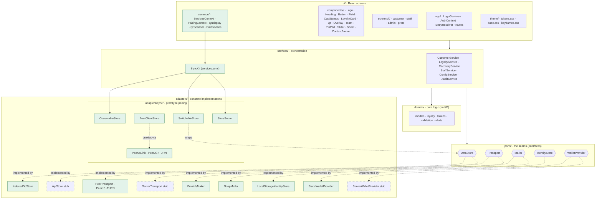
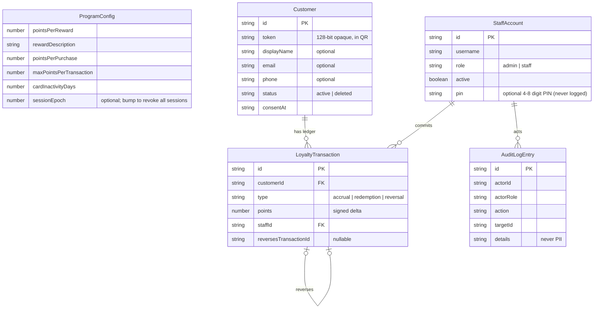
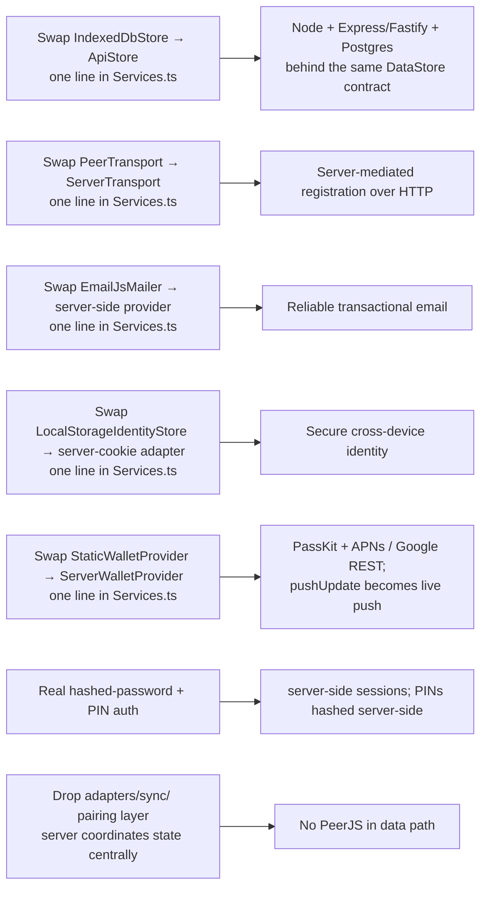

# ☕ Café Loyalty — v1 prototype

A digital loyalty system for a **single café**. Staff scan a customer's QR and
commit loyalty points; customers collect points and earn rewards. **The system
never handles money** — it only tracks loyalty state.

This repo is the **v1 functional prototype**: a React + TypeScript SPA with
browser storage, deployed to GitHub Pages. Its architecture is **true to the
production design**, so going live means swapping pluggable adapters — not a
rewrite. Authoritative requirements live in [`docs/SPEC.md`](docs/SPEC.md);
working rules for agents in [`CLAUDE.md`](CLAUDE.md); current build status in
[`docs/STATUS.md`](docs/STATUS.md).

> ⚠️ **Prototype only.** Browser storage is **not** secure storage. Do not enter
> real customer data.

**Live demo:** https://misch0n.github.io/loyalty-system/ · Demo PINs: admin `4321` / staff `1234` (or username/password: `admin / admin`, `staff / staff`).

---

## Table of contents
- [What it does](#what-it-does)
- [Feature set](#feature-set)
- [Architecture](#architecture)
- [Core flows](#core-flows)
- [Data model](#data-model)
- [Project layout](#project-layout)
- [The pluggable seams](#the-pluggable-seams)
- [Running it](#running-it)
- [Path to production](#path-to-production)

---

## What it does

The trust anchor is **staff-side**: only staff can commit points or redemptions,
because staff presence confirms a real transaction happened. Customers can only
*display* their card. Identity is a **random 128-bit opaque token** (in the QR) —
never derived from name/phone — so a screenshotted card leaks no personal data.
Personal details are **optional**; a fully anonymous (token-only) account is
valid.

Points live in an **append-only ledger**. Balance and "reward available" are
*derived* by summing entries — never stored as a counter. Corrections are
`reversal` entries, never destructive edits. Every staff/admin action writes an
**audit entry**.

---

## Feature set

| Area | Capabilities |
|---|---|
| **Auth — staff/admin PIN + session** | Staff and admin authenticate with a 4–8-digit PIN (seed: admin `4321` / staff `1234`). "Remember this device" creates a trusted terminal session; otherwise the session is ephemeral. 5-minute inactivity locks the device → PIN re-auth at `/staff/unlock`. Admin can revoke all sessions via epoch-based sign-out. `StaffService.loginWithPin`, `setPin`, `revokeAllSessions`. Username/password still accepted. `AuthContext` (`src/ui/app/AuthContext.tsx`) replaces the old `SessionContext`. |
| **Self-service registration** | PRIMARY path: customer visits `/register`, creates their own card in one step — remembered on the browser via `IdentityStore`. No approval queue, no staff involvement. Recovery tier disclosed at registration (email → self-recovery link; name-only → staff best-effort; neither → not recoverable). |
| **Staff-initiated registration** | SECONDARY path: staff start a card over real PeerJS; customer joins on their own device. Duplicate details **warn before** a second card is created. |
| **Auto-provision on scan** | Scanning an unknown-but-valid token creates a token-only card on the staff device so accrual can proceed immediately. Staff still initiates the credit. |
| **Loyalty accrual** | Staff scan → see customer state → add points (default `pointsPerPurchase`, **capped** at `maxPointsPerTransaction`). Appends an `accrual` + audit entry. Sends a best-effort reward-available email on threshold crossing (when customer has an email). Seed threshold: **10 coffees** (`pointsPerReward: 10`). |
| **Redemption** | Staff redeem when balance ≥ threshold. **Atomic** check-and-write — no double-spend. |
| **Self-service recovery** | Customer visits `/lost`, enters their registered email → single-use link (15-min expiry) via EmailJS → opening the link re-establishes identity on the browser. Token-only customers remain unrecoverable by design. Uniform response (no account enumeration). |
| **Staff recovery / reissue** | Staff find customer by name/email/phone; reissue with a rotated token (default) or keep it. |
| **Correction / undo** | Reverse a recent accrual/redemption via an offsetting `reversal` entry — logged, never silent. |
| **Self-delete / opt-out** | `CustomerService.selfDelete(token)` — GDPR erasure initiated from the customer's card "⋯" menu. Staff-confirmed `deleteCustomer(actor, id)` also still exists. |
| **Suspicious-activity alerts** | Pure domain module `src/domain/alerts.ts` evaluates velocity, repeat-target, oversized multi-add, off-hours, outlier-share, and earn-then-redeem patterns against `DEFAULT_THRESHOLDS`. `LoyaltyService.getAlerts()` surfaces results. Monitoring only — no automatic blocking. |
| **Admin — staff** | List / create / disable / re-enable / reset password / set PIN / "Sign out all devices" (epoch revocation). |
| **Admin — program** | Edit threshold, reward text, points-per-purchase, per-transaction cap, inactivity days. Save requires step-up PIN re-auth. |
| **Admin — stats** | "This week" counts: active customers, points issued, rewards redeemed. (Coffees-today approximated by accrual audit event count — see divergences.) |
| **Admin — audit log** | Filterable, append-only staff-attributed action trail (no PII). |
| **Admin — alerts** | Suspicious-activity alerts surfaced from `LoyaltyService.getAlerts()`. |
| **Backup** | JSON export/import (behind the same `DataStore` port). |
| **Wallet — WalletProvider seam** | `src/ports/WalletProvider.ts` (`ensurePass`, `pushUpdate`). Proto adapter: `StaticWalletProvider` links to pre-generated walletwallet.dev passes (`wallet/passes.ts`; `pushUpdate` is no-op — static snapshot). Prod placeholder: `ServerWalletProvider` (throws). Selected by `VITE_WALLET` env flag (default `static`). Wallet button lives inside the **enlarged-QR overlay** (`src/ui/screens/customer/EnlargedQr/EnlargedQr.tsx`), OS-aware (iOS → Apple, Android → Google), mobile-only. |
| **Card view (customer hub)** | A recognized customer lands directly on `/card/:token` — no home dashboard. `EnlargedQr` overlay provides the full-screen QR + wallet button. Card "⋯" menu (`CardMenu`) provides self-delete. The "Gold" tier pill is decorative (v1 has no tiers). |
| **Welcome** | Shown to unrecognized visitors only. Carries **Find us** (location/hours) below the fold. |
| **Reset device** | `Services.reset()` drops the `cafe-loyalty` IndexedDB database and clears storage keys so a workflow can be rerun from a clean device state. Prototype-only. |
| **Device pairing (prototype)** | Every device defaults to hosting. Scanning another device's pairing QR (accessed via the **Prototype panel** — logo tap) makes this device a customer of that till. The till accepts many customer devices simultaneously. Unpairing sends `{ t: 'unpair' }` to all peers; each resumes hosting. `/pair` is scan-only (`?host=` auto-joins). |
| **Prototype panel** | `src/ui/screens/proto/ProtoPanel/ProtoPanel.tsx` (build-flag gated, non-production). Opened by **tapping the right half** of the `LogoGestures` mark. Hosts pairing QR/scan/unpair/reset/sign-in/demo-cards. Replaces old header `PrototypeMenu`. |
| **Logo gestures** | `LogoGestures` (`src/ui/app/LogoGestures.tsx`) — tap left half → home; tap right half → Prototype panel (gated on `isPrototype`, not `import.meta.env.PROD`); long-press ≥600ms → staff/admin sign-in. Visually-hidden keyboard path to sign-in. No global "Staff sign-in" subtitle. |
| **Card QR = card URL (B2)** | The card QR encodes the full card-page URL. `tokenFromCardScan()` extracts the token; bare tokens still accepted. No PII in the URL. |
| **Family / couples sharing (B7)** | Opening the card URL or QR on a second device shows that card without overwriting either device's saved card. Balance pools naturally (one ledger, one token). No feature code needed. |

---

## Architecture

Layered **ports & adapters (hexagonal)**. Dependencies point **inward**: the UI
talks only to services; services orchestrate the pure domain against interfaces
(ports); concrete adapters plug into those ports at one composition root.



**Rules that keep the swap cheap:**
- `domain/` is pure — no I/O, no React, no browser APIs → fully unit-testable and
  shared verbatim with the future Node backend.
- `DataStore` is **async everywhere** (returns Promises), even though IndexedDB
  could be sync, so call sites match the future HTTP adapter byte-for-byte.
- The **composition root** ([`src/services/Services.ts`](src/services/Services.ts))
  is the *only* place that names a concrete adapter.
- The UI **never** touches an adapter or storage directly.

---

## Core flows

### Self-service registration (primary path)

The customer creates their own card without staff involvement. `IdentityStore`
persists the token in the browser so subsequent visits skip registration.


### Staff-initiated registration (secondary path)

Staff and customer devices communicate over **PeerJS + TURN** (real two-device
connection; no single-browser simulation).


### Accrual & redemption (append-only ledger)


---

## Data model

Append-only ledger + audit log. `Customer.token` is the opaque identity; PII is
optional. Balance and reward-availability are derived, never stored.



---

## Project layout

```
src/
├── config/
│   ├── env.ts             # feature flags (VITE_TRANSPORT, VITE_EMAILJS_*, VITE_TURN_*,
│   │                      #   VITE_GOOGLE_PLACE_ID, VITE_WALLET), baseUrl, iceServers, walletKind
│   ├── links.ts           # appUrl() — builds absolute HashRouter URLs for QR + emails
│   └── cafe.ts            # café public details: name, address, Google Maps URL, contact email
├── domain/                # pure logic, fully unit-tested
│   ├── models.ts          # entity types; StaffAccount.pin?, ProgramConfig.sessionEpoch?
│   ├── loyalty.ts         # balance, reward-availability, redemption rules
│   ├── tokens.ts          # 128-bit opaque token generation
│   ├── validation.ts      # input + duplicate checks
│   └── alerts.ts          # suspicious-activity detection (velocity, repeat-target, off-hours…)
├── ports/                 # the seams (interfaces)
│   ├── DataStore.ts       # includes createRecoveryCode / consumeRecoveryCode, getStaffByPin, setStaffPin
│   ├── Transport.ts
│   ├── Mailer.ts          # email abstraction
│   ├── IdentityStore.ts   # browser identity (token storage, no PII)
│   └── WalletProvider.ts  # wallet seam: ensurePass(token, os) → url; pushUpdate(token) → void
├── adapters/
│   ├── storage/
│   │   ├── IndexedDbStore.ts   # prototype storage (schema v2, recoveryCodes store); close() drops DB
│   │   ├── ApiStore.ts         # production HTTP stub
│   │   └── schema.ts           # IndexedDB schema + seed data (admin PIN 4321, staff PIN 1234)
│   ├── transport/
│   │   ├── PeerTransport.ts    # prototype: PeerJS + TURN (real cross-device)
│   │   └── ServerTransport.ts  # production placeholder (throws)
│   ├── email/
│   │   ├── EmailJsMailer.ts    # client-side EmailJS via fetch
│   │   └── NoopMailer.ts       # fallback when EmailJS unconfigured
│   ├── identity/
│   │   └── LocalStorageIdentityStore.ts   # stores token only (no PII)
│   ├── wallet/
│   │   ├── StaticWalletProvider.ts  # proto: pre-generated walletwallet.dev pass URLs; pushUpdate no-op
│   │   └── ServerWalletProvider.ts  # production placeholder (throws)
│   └── sync/                   # PROTOTYPE-ONLY — device pairing via PeerJS (one till, many clients)
│       ├── PeerLink.ts         # channel interface + SyncMessage envelopes (incl. {t:'unpair'})
│       ├── PeerJsLink.ts       # PeerJS+TURN: ConnLink, joinHost() (client),
│       │                       #   PeerJsHost (one peer, many clients)
│       ├── ObservableStore.ts  # DataStore wrapper that emits on mutation
│       ├── SwitchableStore.ts  # DataStore whose target swaps local↔remote at runtime
│       ├── PeerClientStore.ts  # DataStore that proxies calls to host over RPC
│       ├── StoreServer.ts      # host side: one instance per client; serves RPC + pushes changes
│       └── storeMethods.ts     # canonical DataStore method list + mutating subset
├── services/              # orchestrate domain + ports
│   ├── CustomerService.ts      # selfRegister, provisionFromToken, selfDelete(token), reissue…
│   ├── LoyaltyService.ts       # accrue, redeem, reverse, getAlerts()
│   ├── StaffService.ts         # loginWithPin, setPin, revokeAllSessions, currentSessionEpoch
│   ├── ConfigService.ts · AuditService.ts
│   ├── RecoveryService.ts      # self-service recovery (single-use expiring codes)
│   └── Services.ts             # ← composition root; wires adapters → services.wallet (WalletProvider)
│                               #   services.sync (SyncKit); exposes reset() (prototype-only)
├── qr/                    # encode (cardPayload = card-page URL, tokenFromCardScan, registrationPayload) + scan
├── wallet/
│   └── passes.ts          # PRESET_CARD_TOKENS, PASS_SERIALS, passSerialForToken, walletPassUrl,
│                          #   detectWalletKind — walletwallet.dev integration (prototype)
└── ui/
    ├── theme/             # design system slices (no monolith)
    │   ├── tokens.css     #   design tokens: forest/sage/blush/cream/terra palette,
    │   │                  #   Fraunces/DM Sans/DM Mono fonts, spacing, touch targets
    │   ├── base.css       #   reset, .screen shell, utilities, bg-* gradients,
    │   │                  #   focus-visible ring, reduced-motion, .card-hint
    │   ├── keyframes.css  #   animation keyframes
    │   └── index.css      #   single import entry point (used in main.tsx)
    ├── components/        # shared presentational components — folder-per-component
    │   │                  #   each: <Name>.tsx + <Name>.css + <Name>.test.tsx
    │   ├── Logo/          # cup+sunburst mark + lockup
    │   ├── Heading/       # Eyebrow / Title / Sub
    │   ├── Button/        # Button + WalletButton
    │   ├── Field/         # text input; Consent toggle
    │   ├── CupStamps/     # stamp progress row
    │   ├── LoyaltyCard/   # centerpiece card (centerpiece; "Gold" pill is decorative v1)
    │   ├── Qr/            # real QR on cream tile
    │   ├── Overlay/       # enlarged-QR overlay
    │   ├── Toast/         # toast notifications
    │   ├── PinPad/        # numeric PIN pad
    │   ├── Slider/        # PointsSlider
    │   ├── Sheet/         # bottom sheet + MenuRow + RecoveryLine
    │   └── ContextBanner/ # pairing / session context strip
    ├── app/               # LogoGestures, AuthContext (PIN session + inactivity lock),
    │                      #   EntryResolver (entry routing), routes.ts, session.ts
    ├── screens/           # folder-per-screen: <Screen>.tsx + <Screen>.css + <Screen>.test.tsx
    │   ├── customer/      # Welcome/ (+ Find us), Register/, LostCard/, RecoverConsume/,
    │   │                  #   Card/ (hub), EnlargedQr/ (QR + wallet button), CardMenu/
    │   ├── staff/         # Login/, Unlock/ (PIN re-auth), Panel/, Scan/
    │   │                  #   _parts/: TopBar/ ScanView/ CustChip/ StateLabel/
    │   ├── admin/         # Admin/ (tabbed); _parts/: Stat/ FeedRow/ Alert/ StepUp/
    │   └── proto/         # ProtoPanel/ (logo-tap right-half, build-flag gated)
    └── common/            # ServicesContext, PairingContext/usePairing, QrDisplay, QrScanner,
                           #   PrivacyNotice, PairDevices
tests/                     # Vitest: domain, service, adapter, qr, wallet, config, ui/app/session
e2e/                       # Puppeteer smoke suite (headless Chrome, drives built app)
.env.example               # documents required build-time secrets
.github/workflows/deploy.yml   # build + test + deploy (injects secrets at build time)
```

---

## The pluggable seams

| Seam | Prototype adapter | Production adapter | Swap cost |
|---|---|---|---|
| **`DataStore`** (persistence) | `IndexedDbStore` | `ApiStore` → Node + Postgres | One line in `Services.ts` |
| **`Transport`** (registration handoff) | `PeerTransport` (PeerJS + TURN) | `ServerTransport` (server-mediated) | One line in `Services.ts` |
| **`Mailer`** (email) | `EmailJsMailer` (client-side EmailJS) or `NoopMailer` | Server-side provider | One line in `Services.ts` |
| **`IdentityStore`** (browser identity) | `LocalStorageIdentityStore` | Server-cookie adapter | One line in `Services.ts` |
| **`WalletProvider`** (wallet passes) | `StaticWalletProvider` (pre-generated walletwallet.dev URLs; `pushUpdate` no-op) | `ServerWalletProvider` (PassKit + APNs / Google REST) | One line in `Services.ts` + `VITE_WALLET=server` |
| **`adapters/sync/` (device pairing)** | `PeerJsHost` / `ConnLink` / `joinHost` + `SwitchableStore` stack (one till, many clients) | Server-mediated DataStore — remove the sync layer | Rewire composition root |

### Prototype transport
`adapters/transport/PeerTransport.ts` uses PeerJS with a Metered TURN relay for
real two-device connectivity. Selected when `VITE_TRANSPORT=peer` (the default).
TURN credentials and EmailJS keys are **build-time-injected demo secrets** —
publicly readable in the static bundle, rotated after demos. See `.env.example`
for the full list. `adapters/transport/ServerTransport.ts` is the production
placeholder (every method throws until the backend exists).

### Prototype device pairing
`adapters/sync/` is a second PeerJS-backed channel, separate from registration.
Every device defaults to hosting: `PeerJsHost` creates one PeerJS peer that
accepts **many simultaneous client connections**. Each accepted connection becomes
a `ConnLink` handed to an `onClient` subscriber; the host spawns one `StoreServer`
per client, so change notifications fan out to every paired device. The till's
pairing QR lives in the **Prototype panel** (logo tap, not a dedicated page); `/pair`
is now scan-only and auto-joins on a `?host=` URL parameter.

Once a customer device scans the QR, `joinHost(remoteId)` dials the till and
returns an open `ConnLink`. The customer device's `DataStore` is transparently
replaced (via `SwitchableStore`) with a `PeerClientStore` that proxies all reads
and writes to the host over RPC. `SyncMessage` now includes a `{ t: 'unpair' }`
variant — sent by either side when unpairing — so every peer can clean up
gracefully. After unpairing, each device resumes hosting so its QR becomes
available again.

Screens (`Status`, `CustomerStatePanel`) refetch on the `dataVersion` counter
exposed by `PairingProvider`. This is the **no-backend stand-in for the production
server**: in production, the server coordinates state centrally and the sync layer
is dropped entirely.

---

## Running it

```bash
npm install
npm run dev        # http://localhost:5173
npm test           # 341 unit/component tests (Vitest — includes src/ui/**/*.test.tsx)
npm run build      # static output in dist/
npm run preview    # serve dist/ locally (required for e2e)
npm run e2e          # browser UI regression suite (Puppeteer headless Chrome: builds, serves, runs)
npm run typecheck  # strict TS, no emit
```

Copy `.env.example` to `.env.local` and fill in your credentials before running
locally (TURN + EmailJS). `.env.local` is gitignored.

**Two-device demo:** PeerJS transport is the default. Open `http://localhost:5173`
on two devices on the same network (or use the deployed Pages URL). For
registration: scan the registration QR from the customer device. For live pairing:
tap the logo on one device to open the Prototype panel — its pairing QR is shown;
tap "Scan a code" on the other device to scan it. The scanned device becomes the
customer and is routed to `/`; the till is routed to `/staff` on first pair. The
till shows the live paired-device count and an "Unpair all" button; a paired
customer shows "Paired to the till" with Unpair + Reset. Multiple customer devices
can pair to the same till simultaneously. State reflects live on all paired
devices. Use "Reset this device" (also in the Prototype panel) to rerun a workflow
from a clean state.

Sign in as staff/admin: PIN `4321` (admin) or `1234` (staff) via the long-press `LogoGestures` mark or the Prototype panel. Username/password (`admin / admin`, `staff / staff`) also accepted. Reward threshold is 10 coffees (configurable via Admin → Program).

### Deployment
Pushing to `main` runs [`.github/workflows/deploy.yml`](.github/workflows/deploy.yml):
it installs, **runs tests**, builds with the Pages base path (`/loyalty-system/`),
injects `VITE_EMAILJS_*`, `VITE_TURN_*`, and `VITE_GOOGLE_PLACE_ID` secrets from
GitHub repository secrets into the static bundle, and publishes to GitHub Pages. Routing uses `HashRouter`,
so no server rewrites are needed (a `public/404.html` fallback is shipped as a
belt-and-braces). `VITE_TRANSPORT` defaults to `peer`, so the deployed build uses
PeerJS on real devices.

> Pages source must be set to **GitHub Actions** (Settings → Pages → Source).
> Secrets must be added under Settings → Secrets → Actions before the first deploy.

---

## Path to production

Bounded and mechanical (see [SPEC §14](docs/SPEC.md)):



Because every app call already goes through async ports, **no UI or service call
site changes**. `domain/` and `ports/` move/share into the backend unchanged.
