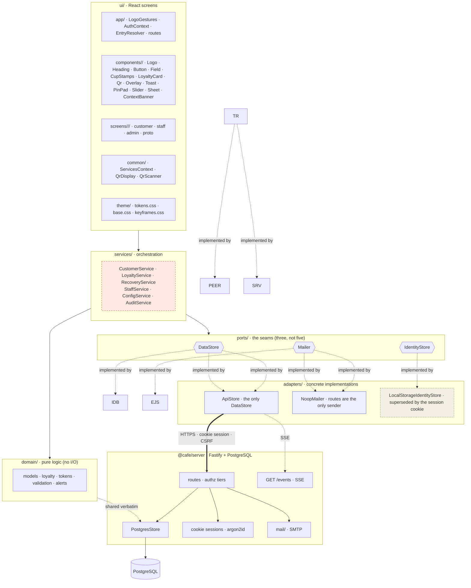
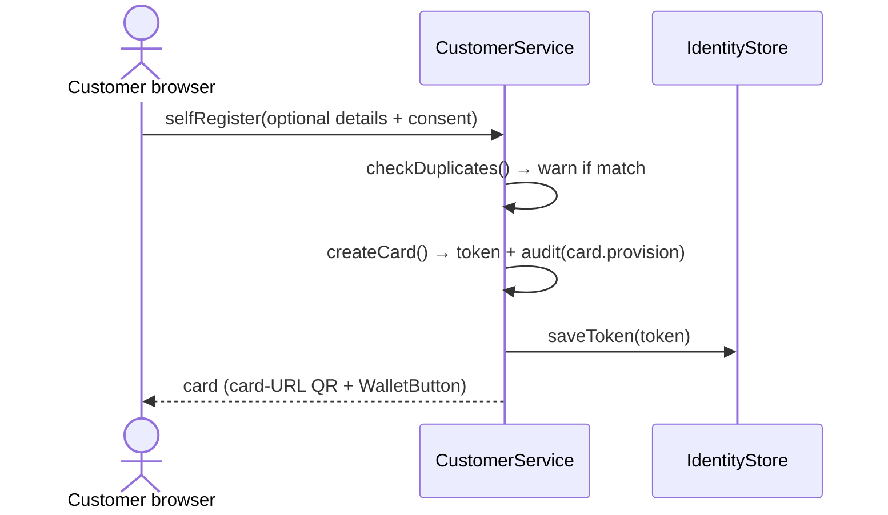
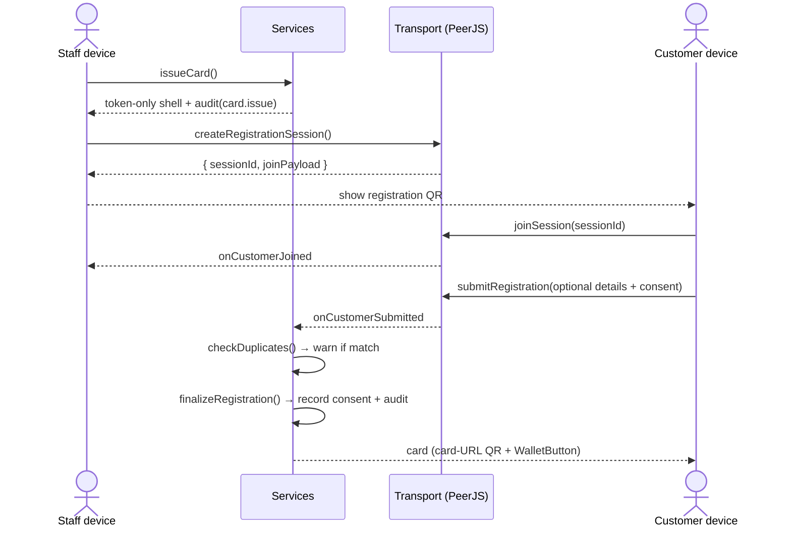
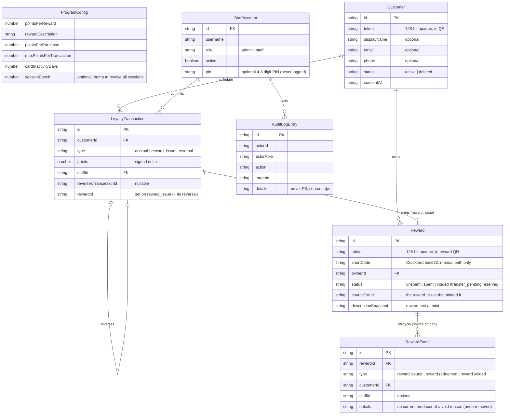
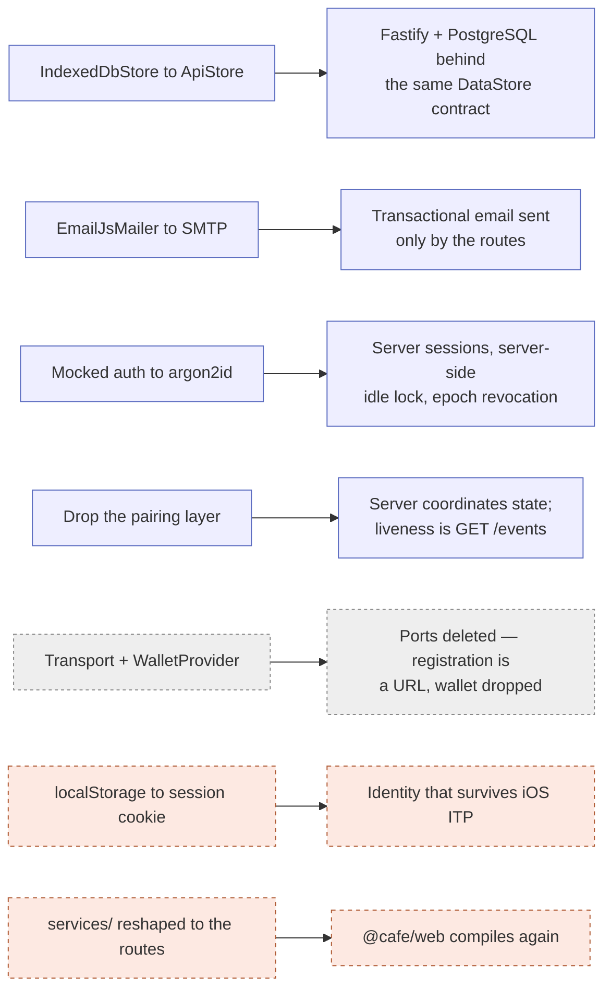

# ☕ Café Loyalty

A digital loyalty system for a **single café**. Staff scan a customer's QR and
commit loyalty points; customers collect points and earn rewards. **The system
never handles money** — it only tracks loyalty state.

**Three-package monorepo:** `@cafe/shared` (the pure contract — `domain/` + `ports/`),
`@cafe/server` (Node + Fastify + PostgreSQL), `@cafe/web` (the React SPA). It runs as a
Docker Compose bundle. Authoritative requirements live in [`docs/SPEC.md`](docs/SPEC.md);
working rules for agents in [`CLAUDE.md`](CLAUDE.md); current build status in
[`docs/STATUS.md`](docs/STATUS.md).

> ### ⚠️ Mid-migration — read this before the tables below
>
> The **backend is complete** (all of [`docs/BACKEND-PLAN.md`](docs/BACKEND-PLAN.md): the API,
> cookie sessions, argon2id credentials, SSE liveness, CI, the Compose bundle). The
> **browser-storage prototype was deleted** in Phase 6 — no IndexedDB, no PeerJS device pairing,
> no wallet passes, no GitHub Pages demo.
>
> **`@cafe/web` does not currently compile.** That is deliberate
> ([`docs/SCOPE-DECISIONS.md`](docs/SCOPE-DECISIONS.md) §6): the backend was built first and the
> UI is now being rewritten against it, tracked in [`docs/UI-PLAN.md`](docs/UI-PLAN.md) against the
> 27 conflicts in [`docs/UI-RECONCILIATION.md`](docs/UI-RECONCILIATION.md). **There is no demoable
> build until that lands**, and the live-demo link is gone with the Pages workflow.
>
> **The feature table and screen descriptions below still describe the pre-migration SPA** — the
> files exist in the tree and do not build. They are rewritten in UI-PLAN's UI-9. The
> architecture section and diagram *have* been corrected and describe what is really there.

---

## Table of contents
- [What it does](#what-it-does)
- [Feature set](#feature-set)
- [Architecture](#architecture)
- [Core flows](#core-flows)
- [Data model](#data-model)
- [Project layout](#project-layout)
- [The pluggable seams](#the-pluggable-seams)
- [Running it](#running-it)
- [Path to production](#path-to-production)

---

## What it does

The trust anchor is **staff-side**: only staff can commit points or redemptions,
because staff presence confirms a real transaction happened. Customers can only
*display* their card. Identity is a **random 128-bit opaque token** (in the QR) —
never derived from name/phone — so a screenshotted card leaks no personal data.
Personal details are **optional**; a fully anonymous (token-only) account is
valid.

Points live in an **append-only ledger**. Balance is *derived* by summing entries
(it settles to `0..threshold−1`) — never stored as a counter. Crossing the
threshold mints a discrete, countable **`Reward` object** (`reward_issue` ledger
entry + `reward.issued` event); the "N free coffees" a customer holds is the count
of **unspent rewards**, not a boolean. The staff counter **stages** every
transaction behind a 3-second pre-commit hold (Cancel / "Commit now") before it's
ever written; corrections to something already written are `reversal` entries,
never destructive edits. Every staff/admin action writes an **audit entry**, and
two attributed detectors (self-dealing, repeat-target) monitor — never block —
for suspicious patterns. See [`docs/STATUS.md`](docs/STATUS.md) ("Rewards-as-objects"
and "Staff integrity & observability acceptance (E9)") for the full reward/QR and
pre-commit-hold models.

---

## Feature set

| Area | Capabilities |
|---|---|
| **Auth — staff/admin sign-in + session** | Accounts carry **name + username + password + PIN**. The first sign-in on a device is **username/password** (seed: `admin / admin`, `staff / staff`); on success the visitor routes to their role home (admin → `/admin`, staff → `/staff`). "Remember this device" creates a trusted terminal; a 5-minute inactivity lock then re-auths with the quick **PIN** (seed: admin `4321` / staff `1234`) at `/staff/unlock` rather than the full form. A non-remembered device prefills the last username. Admin can revoke all sessions via epoch-based sign-out. `StaffService.login` / `loginWithPin` / `setPin` / `revokeAllSessions`; `AuthContext.loginWithPassword` / `unlock` (`src/ui/app/AuthContext.tsx`). |
| **Self-service registration** | PRIMARY path: customer visits `/register`, creates their own card in one step — remembered on the browser via `IdentityStore`. No approval queue, no staff involvement. Recovery tier disclosed at registration (email → self-recovery link; name-only → staff best-effort; neither → not recoverable). |
| **Staff-initiated registration** | SECONDARY path: staff start a card over real PeerJS; customer joins on their own device. Duplicate details **warn before** a second card is created. |
| **Auto-provision on scan** | Scanning an unknown-but-valid token creates a token-only card on the staff device so accrual can proceed immediately. Staff still initiates the credit. |
| **Unified commit (accrue + mint + redeem)** | Staff scan → see customer state → the counter **stages** the transaction behind a **3-second pre-commit hold** (countdown summarizing points/redemptions/mints-to-come; Cancel or "Commit now"; idempotency key allocated at stage time). On timeout/commit, a single **atomic, idempotent** `commit` adds points (default `pointsPerPurchase`, **capped** at `maxPointsPerTransaction` → `over_cap` reject), **mints** one `Reward` per threshold crossing (`mintFold`), and **redeems** any pre-checked rewards in the same call. Appends `accrual`/`reward_issue` ledger entries + reward events + audit. Sends a best-effort reward-available email only when the commit minted ≥1 reward. Terminal auto-advances to the scanner after each commit. Seed threshold: **9 purchases** (`pointsPerReward: 9`) — the card shows a fixed 10-cup grid whose last (FREE) cup is pre-stamped, so the tenth coffee is the free one. |
| **Redemption (multi-reward, subset)** | Redeemed inside the unified `commit` — every reward id is re-validated at commit (`not_owner`/`already_spent`/`reward_invalid` → `rejected[]`, valid ones still redeem); a customer can compose **multiple** rewards into one reward QR. **Atomic + idempotent** (single IDB-tx scope) — no double-spend. |
| **Self-service recovery** | Customer visits `/lost`, enters their registered email → single-use link (15-min expiry) via EmailJS → opening the link re-establishes identity on the browser. Token-only customers remain unrecoverable by design. Uniform response (no account enumeration). *In the server build this is a **typed code**, not a link (SCOPE-DECISIONS §2.3): a link opens on whichever device reads the mail, so the customer types a six-character code on the device in their hand and that device is what gets bound. Built in `packages/server/src/recovery/` + `routes/recovery.ts`; see STATUS divergence **x**.* |
| **Staff recovery / reissue** | Staff find customer by name/email/phone; reissue with a rotated token (default) or keep it. |
| **Correction / reversal** | Reverse a recent accrual via an offsetting `reversal` entry — logged, never silent (`LoyaltyService.reverse`). There is no post-commit undo: the staff counter's 3-second pre-commit hold (above) catches operator errors *before* anything is written instead. |
| **Self-delete / opt-out** | `CustomerService.selfDelete(token)` — GDPR erasure initiated from the customer's card "⋯" menu. Staff-confirmed `deleteCustomer(actor, id)` also still exists. |
| **Suspicious-activity alerts** | Pure domain module `packages/shared/src/domain/alerts.ts` evaluates exactly two attributed detectors — **self-dealing** (same staff accrues then redeems on the same card repeatedly within a window) and **repeat-target** (same customer credited repeatedly within a window) — against thresholds on `ProgramConfig` (admin-configurable). `LoyaltyService.getAlerts()` surfaces results. Monitoring only — no automatic blocking; no role exemption. |
| **Admin — staff** | List / create / disable / re-enable / reset password / set PIN / "Sign out all devices" (epoch revocation). |
| **Admin — program** | Edit threshold, reward text, points-per-purchase, per-transaction cap, inactivity days, and the four alert-detector thresholds. Save requires step-up PIN re-auth. |
| **Admin — stats** | "This week" counts: active customers, points issued, rewards redeemed (counted from `reward.redeemed` events, surfaced as `loyalty.redeem` audit rows — not the ledger). `StatDetail` popover shows total + chart only (no per-action feed). (Coffees-today approximated by accrual audit event count — see divergences.) |
| **Admin — activity export** | The append-only audit log is not casually browsable — cross-account/historical activity is reached only through a reason-gated export: a blank-by-default filter (time range · action(s) · account(s) incl. admins), disabled until a reason is typed, produces a downloaded JSON file, and is itself an audited `audit.export` row. Past exports are listed and re-runnable. `AuditService.exportActivity`, `ui/screens/admin/_parts/Export/`. |
| **Admin — alerts** | Suspicious-activity alerts surfaced from `LoyaltyService.getAlerts()`. |
| **Staff — "Your last hour"** | The counter's recent-activity list is scoped to the **signed-in staffer's own actions in the last hour**, capped at 10 rows, no "Load all" — never a full or cross-staff history. |
| **Backup** | JSON export/import (behind the same `DataStore` port). |
| **Wallet — WalletProvider seam** | `src/ports/WalletProvider.ts` (`ensurePass`, `pushUpdate`). Proto adapter: `StaticWalletProvider` links to pre-generated walletwallet.dev passes (`wallet/passes.ts`; `pushUpdate` is no-op — static snapshot). Prod placeholder: `ServerWalletProvider` (throws). Selected by `VITE_WALLET` env flag (default `static`). Wallet button lives inside the **enlarged-QR overlay** (`src/ui/screens/customer/EnlargedQr/EnlargedQr.tsx`), OS-aware (iOS → Apple, Android → Google), mobile-only. |
| **Card view (customer hub)** | A recognized customer lands directly on `/card/:token` — no home dashboard. `EnlargedQr` overlay provides the full-screen QR + wallet button. Card "⋯" menu (`CardMenu`) provides self-delete. The "Gold" tier pill is decorative (v1 has no tiers). |
| **Welcome** | Shown to unrecognized visitors only. Carries **Find us** (location/hours) below the fold. |
| **Reset device** | `Services.reset()` drops the `cafe-loyalty` IndexedDB database and clears storage keys so a workflow can be rerun from a clean device state. Prototype-only. |
| **Device pairing (prototype)** | Every device defaults to hosting. Scanning another device's pairing QR (accessed via the **developer panel** — hidden top-left dev trigger) makes this device a customer of that till. The till accepts many customer devices simultaneously. Unpairing sends `{ t: 'unpair' }` to all peers; each resumes hosting. `/pair` is scan-only (`?host=` auto-joins). |
| **Developer (Prototype) panel** | `packages/web/src/ui/screens/proto/ProtoPanel/ProtoPanel.tsx` (build-flag gated, non-production). Opened by a **hidden top-left `DevTrigger`** (`packages/web/src/ui/app/DevTrigger.tsx`) present on every view. Stripped to three centred controls, in order: **QR · Scan to pair · Reset**. (Demo-card jumping, view-jumps and the sign-in shortcut were removed; every prototype card starts at zero and registration rotates which preset token is handed out.) |
| **Logo gestures** | `LogoGestures` (`packages/web/src/ui/app/LogoGestures.tsx`) — **tap → home** (role-aware via `EntryResolver`); long-press ≥600ms → staff/admin sign-in. The developer panel has its own hidden `DevTrigger`, not a logo tap. Visually-hidden keyboard path to sign-in. No global "Staff sign-in" subtitle. |
| **Card QR = card URL (B2)** | The card QR encodes the full card-page URL. `tokenFromCardScan()` extracts the token; bare tokens still accepted. No PII in the URL. |
| **Family / couples sharing (B7)** | Opening the card URL or QR on a second device shows that card without overwriting either device's saved card. Balance pools naturally (one ledger, one token). No feature code needed. |

---

## Architecture

Layered **ports & adapters (hexagonal)**. Dependencies point **inward**: the UI
talks only to services; services orchestrate the pure domain against interfaces
(ports); concrete adapters plug into those ports at one composition root.


```mermaid
flowchart TB
    subgraph ui["ui/ · React screens"]
        APP["app/ · LogoGestures · AuthContext · EntryResolver · routes"]
        KIT["components/<Name>/ · Logo · Heading · Button · Field · CupStamps · LoyaltyCard · Qr · Overlay · Toast · PinPad · Slider · Sheet · ContextBanner"]
        SCR["screens/<area>/<Screen>/ · customer · staff · admin · proto"]
        CMN["common/ · ServicesContext · QrDisplay · QrScanner"]
        THM["theme/ · tokens.css · base.css · keyframes.css"]
    end

    subgraph services["services/ · orchestration"]
        SVC["CustomerService · LoyaltyService · RecoveryService<br/>StaffService · ConfigService · AuditService"]:::todo
    end

    subgraph domain["domain/ · pure logic (no I/O)"]
        DOM["models · loyalty · tokens · validation · alerts"]
    end

    subgraph ports["ports/ · the seams (three, not five)"]
        DS{{DataStore}}
        ML{{Mailer}}
        ID{{IdentityStore}}
    end

    subgraph adapters["adapters/ · concrete implementations"]
        API[ApiStore · the only DataStore]:::prod
        NOOP[NoopMailer · routes are the only sender]:::prod
        LSI[LocalStorageIdentityStore · superseded by the session cookie]:::proto
    end

    subgraph server["@cafe/server · Fastify + PostgreSQL"]
        PGS[PostgresStore]
        RT[routes · authz tiers]
        AUTH[cookie sessions · argon2id]
        SSE[GET /events · SSE]
        MAIL[mail/ · SMTP]
    end

    ui --> services --> domain
    services --> ports
    DS -.implemented by.-> API
    ML -.implemented by.-> NOOP
    ID -.implemented by.-> LSI
    API == "HTTPS · cookie session · CSRF" ==> RT
    API -. "SSE" .-> SSE
    RT --> PGS & AUTH & MAIL
    PGS --> DB[(PostgreSQL)]
    domain -. "shared verbatim" .-> PGS
    DS -.implemented by.-> IDB & API
    TR -.implemented by.-> PEER & SRV
    ML -.implemented by.-> EJS & NOOP

    classDef prod fill:#eef,stroke:#5b6cc0;
    classDef proto fill:#f3efe3,stroke:#8a7a4f,stroke-dasharray:3;
    classDef todo fill:#fde9e2,stroke:#af5a33,stroke-dasharray:4;
```

**Legend:** solid = built and tested · dashed amber = superseded, awaiting the UI pass · dashed
terracotta = does not compile until the UI pass reshapes it.


**Rules that made the swap cheap** (they did — the store swap needed no call-site change at the
port boundary; the UI rewrite now under way is a deliberate choice, not a failure of them):
- `domain/` is pure — no I/O, no React, no browser APIs → fully unit-testable and
  **now genuinely shared** with the Node backend as `@cafe/shared`, imported by both packages
  through its `exports` map rather than copied.
- `DataStore` is **async everywhere** (returns Promises). It was async from day one so that
  browser-storage call sites would match an HTTP adapter byte-for-byte — and they did.
- The **composition root** ([`packages/web/src/services/Services.ts`](packages/web/src/services/Services.ts))
  is the *only* place that names a concrete adapter.
- The UI **never** touches an adapter or storage directly.

---

## Core flows

### Self-service registration (primary path)

The customer creates their own card without staff involvement. `IdentityStore`
persists the token in the browser so subsequent visits skip registration.


```mermaid
sequenceDiagram
    actor C as Customer browser
    participant App as CustomerService
    participant IS as IdentityStore

    C->>App: selfRegister(optional details + consent)
    App->>App: checkDuplicates() → warn if match
    App->>App: createCard() → token + audit(card.provision)
    App->>IS: saveToken(token)
    App-->>C: card (card-URL QR + WalletButton)
```

### Staff-initiated registration (secondary path)

Staff and customer devices communicate over **PeerJS + TURN** (real two-device
connection; no single-browser simulation).


```mermaid
sequenceDiagram
    actor S as Staff device
    participant App as Services
    participant T as Transport (PeerJS)
    actor C as Customer device

    S->>App: issueCard()
    App-->>S: token-only shell + audit(card.issue)
    S->>T: createRegistrationSession()
    T-->>S: { sessionId, joinPayload }
    S-->>C: show registration QR
    C->>T: joinSession(sessionId)
    T-->>S: onCustomerJoined
    C->>T: submitRegistration(optional details + consent)
    T-->>App: onCustomerSubmitted
    App->>App: checkDuplicates() → warn if match
    App->>App: finalizeRegistration() → record consent + audit
    App-->>C: card (card-URL QR + WalletButton)
```

### Unified commit — accrue + mint + redeem (append-only ledger + reward objects)

A single atomic, idempotent `commitCounterTransaction` adds points, mints a reward per
threshold crossing, and redeems any pre-checked rewards — all in **one PostgreSQL transaction
  with `SELECT … FOR UPDATE` on the customer row**, so two tills committing at once serialise
  rather than interleave (the one guarantee browser storage could not give). The
staff counter **stages** the transaction and blocks on a 3-second pre-commit hold before
calling `commit` at all — nothing is written until the hold elapses or "Commit now" is
tapped.


```mermaid
flowchart LR
    SCAN([Staff scans card /c or reward /r]) --> STATE[Resolve customer<br/>balance = Σ ledger 0..threshold-1<br/>unspent rewards]
    STATE --> HOLD["Stage transaction<br/>3s pre-commit hold — Cancel or Commit now"]
    HOLD -- cancel: no write --> SCAN
    HOLD -- timeout / commit now --> COMMIT["commit(pointsDelta, redeemRewardIds[])<br/>idempotent on key allocated at stage time"]
    COMMIT --> CAP{over cap?}
    CAP -- yes --> REJ[reject: over_cap] --> STATE
    CAP -- no --> ACC[(append accrual + audit)]
    ACC --> MINT{balance ≥ threshold?}
    MINT -- yes --> M[(mintFold: reward_issue -threshold<br/>+ Reward + reward.issued, repeat)]
    MINT -- no --> R
    M --> R[redeem each id]
    R --> VAL{valid + owned + unspent?}
    VAL -- yes --> SPEND[(reward.redeemed)]
    VAL -- no --> RR["rejected[]: not_owner / already_spent / reward_invalid"]
    SPEND --> NEXT([auto-advance to scanner])
```

---

## Data model

Append-only ledger + audit log + append-only reward-event log. `Customer.token` is
the opaque identity; PII is optional. Balance is derived (settles to
`0..threshold−1`), never stored; rewards are discrete `Reward` objects whose status
is driven only by `RewardEvent`s (the `rewards` store is a materialized projection).


```mermaid
erDiagram
    ProgramConfig {
        number pointsPerReward
        string rewardDescription
        number pointsPerPurchase
        number maxPointsPerTransaction
        number cardInactivityDays
        number sessionEpoch "optional; bump to revoke all sessions"
    }
    StaffAccount {
        string id PK
        string username
        string role "admin | staff"
        boolean active
        string pin "optional 4-8 digit PIN (never logged)"
    }
    Customer {
        string id PK
        string token "128-bit opaque, in QR"
        string displayName "optional"
        string email "optional"
        string phone "optional"
        string status "active | deleted"
        string consentAt
    }
    LoyaltyTransaction {
        string id PK
        string customerId FK
        string type "accrual | reward_issue | reversal"
        number points "signed delta"
        string staffId FK
        string reversesTransactionId "nullable"
        string rewardId "set on reward_issue (+ its reversal)"
    }
    Reward {
        string id PK
        string token "128-bit opaque, in reward QR"
        string shortCode "Crockford base32; manual path only"
        string ownerId FK
        string status "unspent | spent | voided (transfer_pending reserved)"
        string sourceTxnId "the reward_issue that minted it"
        string descriptionSnapshot "reward text at mint"
    }
    RewardEvent {
        string id PK
        string rewardId FK
        string type "reward.issued | reward.redeemed | reward.voided"
        string customerId FK
        string staffId "optional"
        string details "no current producer of a void reason (undo removed)"
    }
    AuditLogEntry {
        string id PK
        string actorId
        string actorRole
        string action
        string targetId
        string details "never PII; source: a|w"
    }

    Customer ||--o{ LoyaltyTransaction : "has ledger"
    StaffAccount ||--o{ LoyaltyTransaction : "commits"
    LoyaltyTransaction |o--o| LoyaltyTransaction : "reverses"
    Customer ||--o{ Reward : "owns"
    LoyaltyTransaction ||--o| Reward : "mints (reward_issue)"
    Reward ||--o{ RewardEvent : "lifecycle (source of truth)"
    StaffAccount ||--o{ AuditLogEntry : "acts"
```

---

## Project layout

Three-package npm-workspaces monorepo (`packages/*`) since BACKEND-PLAN Phase 10 — a file move
plus the config to make it real, not a rewrite. `@cafe/shared` holds the pure contract,
`@cafe/server` the production backend, `@cafe/web` this prototype SPA.

> ⚠ **The `web/src/ui/` entries below still describe screens the UI pass will delete** — the
> Prototype panel, `PairingContext`, `PairDevices`, the wallet button. The adapters, ports and seam
> table above are **correct as of Phase 11**; the `ui/` subtree is UI-PLAN UI-9's job.

```
packages/
├── shared/                     # @cafe/shared — the pure contract, resolved as a real package
│   │                           #   via its own package.json `exports` map (not a path alias)
│   ├── src/
│   │   ├── domain/                # pure logic, fully unit-tested
│   │   │   ├── models.ts          # entity types; StaffAccount.pin?, ProgramConfig.sessionEpoch?
│   │   │   ├── loyalty.ts         # balance derivation (settles 0..threshold-1)
│   │   │   ├── rewards.ts         # rewards-as-objects: mintFold, unspentRewards, cardProgress,
│   │   │   │                      #   validateRedemption, isOverCap (no undo decision — retired)
│   │   │   ├── tokens.ts          # 128-bit opaque token generation
│   │   │   ├── validation.ts      # input + duplicate checks
│   │   │   └── alerts.ts          # self-dealing + repeat-target detectors, thresholds on ProgramConfig
│   │   └── ports/                 # the seams (interfaces)
│   │       ├── DataStore.ts       # commitCounterTransaction / listRewards / getCustomerState,
│   │       │                      #   listAudit(AuditFilter: actions[]/actorIds[]/from/to),
│   │       │                      #   setStaffPin. Split by trust: TrustedStore holds appendAudit +
│   │       │                      #   the recovery-code pair, which only the server may call
│   │       ├── Mailer.ts          # email abstraction (NoopMailer only client-side; routes send)
│   │       └── IdentityStore.ts   # browser identity — superseded by the server session cookie
│   └── tests/                  # Vitest: the six domain suites (moved out of the SPA in Phase 10;
│                                #   green independently of it)
├── server/                     # @cafe/server — Fastify + PostgreSQL production backend
│   └── src/
│       ├── testing/
│       │   └── dataStoreConformance.ts   # store-agnostic DataStore suite (moved from
│       │                                 #   tests/conformance/ in Phase 10); run by PostgresStore.test.ts
│       └── …                   # routes/, auth/, mail/, recovery/, migrations — see docs/BACKEND-PLAN.md
└── web/                         # @cafe/web — this prototype SPA
    ├── src/
    │   ├── config/
    │   │   ├── env.ts             # what survives of the flags: baseUrl, VITE_GOOGLE_PLACE_ID.
    │   │   │                      #   The adapter flags and EmailJS/TURN config went in Phase 6
    │   │   ├── links.ts           # appUrl() — builds absolute HashRouter URLs for QR + emails
    │   │   └── cafe.ts            # café public details: name, address, Google Maps URL, contact email
    │   ├── adapters/
    │   │   ├── storage/
    │   │   │   └── ApiStore.ts     # the only DataStore — HTTP to @cafe/server.
    │   │   │                       #   `request` is still unwritten: UI-PLAN UI-1
    │   │   ├── email/
    │   │   │   └── NoopMailer.ts   # the routes are the only sender
    │   │   └── identity/
    │   │       └── LocalStorageIdentityStore.ts   # superseded by the session cookie (UI-PLAN UI-3)
    │   ├── services/              # orchestrate domain + ports
    │   │   ├── CustomerService.ts      # selfRegister, provisionFromToken, selfDelete(token), reissue…
    │   │   ├── LoyaltyService.ts       # commit (accrue+mint+redeem), getState, reverse, getAlerts()
    │   │   ├── StaffService.ts         # loginWithPin, setPin, revokeAllSessions, currentSessionEpoch
    │   │   ├── ConfigService.ts        # incl. alert-detector thresholds
    │   │   ├── AuditService.ts         # list, exportActivity (reason-gated, writes audit.export)
    │   │   ├── RecoveryService.ts      # self-service recovery (single-use expiring codes)
    │   │   └── Services.ts             # ← composition root; wires adapters → services.wallet (WalletProvider)
    │   │                               #   services.sync (SyncKit); exposes reset() (prototype-only)
    │   ├── qr/                    # encode (cardPayload = card-page URL, tokenFromCardScan, registrationPayload) + scan
    │   ├── wallet/
    │   │   └── passes.ts          # PRESET_CARD_TOKENS, PASS_SERIALS, passSerialForToken, walletPassUrl,
    │   │                          #   detectWalletKind — walletwallet.dev integration (prototype)
    │   └── ui/
    │       ├── theme/             # design system slices (no monolith)
    │       │   ├── tokens.css     #   design tokens: forest/sage/blush/cream/terra palette,
    │       │   │                  #   Fraunces/DM Sans/DM Mono fonts, spacing, touch targets
    │       │   ├── base.css       #   reset, .screen shell, utilities, bg-* gradients,
    │       │   │                  #   focus-visible ring, reduced-motion, .card-hint
    │       │   ├── keyframes.css  #   animation keyframes
    │       │   └── index.css      #   single import entry point (used in main.tsx)
    │       ├── components/        # shared presentational components — folder-per-component
    │       │   │                  #   each: <Name>.tsx + <Name>.css + <Name>.test.tsx
    │       │   ├── Logo/          # cup+sunburst mark + lockup
    │       │   ├── Heading/       # Eyebrow / Title / Sub
    │       │   ├── Button/        # Button + WalletButton
    │       │   ├── Field/         # text input; Consent toggle
    │       │   ├── CupStamps/     # stamp progress row
    │       │   ├── LoyaltyCard/   # centerpiece card (centerpiece; "Gold" pill is decorative v1)
    │       │   ├── Qr/            # real QR on cream tile
    │       │   ├── Overlay/       # enlarged-QR overlay
    │       │   ├── Toast/         # toast notifications
    │       │   ├── PinPad/        # numeric PIN pad
    │       │   ├── Slider/        # PointsSlider
    │       │   ├── Sheet/         # bottom sheet + MenuRow + RecoveryLine
    │       │   └── ContextBanner/ # pairing / session context strip
    │       ├── app/               # LogoGestures, AuthContext (PIN session + inactivity lock),
    │       │                      #   EntryResolver (entry routing), routes.ts, session.ts
    │       ├── screens/           # folder-per-screen: <Screen>.tsx + <Screen>.css + <Screen>.test.tsx
    │       │   ├── customer/      # Welcome/ (+ Find us), Register/, LostCard/, RecoverConsume/,
    │       │   │                  #   Card/ (hub), EnlargedQr/ (QR + wallet button), CardMenu/
    │       │   ├── staff/         # Login/, Unlock/ (PIN re-auth), Panel/ ("Your last hour"), Scan/
    │       │   │                  #   (3s pre-commit hold: stage → countdown → Cancel/Commit now)
    │       │   │                  #   _parts/: TopBar/ ScanView/ CustChip/ StateLabel/
    │       │   ├── admin/         # Admin/ (tabbed); _parts/: Stat/ StatDetail/ FeedRow/ Alert/ StepUp/
    │       │   │                  #   AccountSheet/ ProgramEdit/ Export/ (reason-gated JSON activity export)
    │       │   └── proto/         # ProtoPanel/ (hidden top-left DevTrigger, build-flag gated)
    │       └── common/            # ServicesContext, PairingContext/usePairing, QrDisplay, QrScanner,
    │                              #   PrivacyNotice, PairDevices
    ├── tests/                     # Vitest: service, adapter, qr, wallet, config, ui/app/session
    ├── e2e/                       # Puppeteer smoke suite (headless Chrome, drives built app)
    ├── index.html, public/, vite.config.ts, vitest.e2e.config.ts, tsconfig*.json
    └── .env.example               # documents required build-time secrets (stale post-Phase 6 — see STATUS.md)
.github/workflows/ci.yml       # contract · server (+Postgres service) · bundle (compose) · web
ops/                           # backup.sh, restore.sh, smoke.sh, drill.sh, nginx/, README.md
```

---

## The pluggable seams

| Seam | Prototype adapter | Production adapter | Swap cost |
|---|---|---|---|
| **`DataStore`** (persistence) | ~~`IndexedDbStore`~~ *deleted* | **Built:** `ApiStore` → Fastify + PostgreSQL | Done — `ApiStore` is now the only `DataStore` |
| ~~**`Transport`**~~ (registration handoff) | ~~`PeerTransport`~~ | **Port deleted** (triage §1) — registration is a customer opening a URL | n/a |
| ~~**`WalletProvider`**~~ | ~~`StaticWalletProvider`~~ | **Port deleted** (triage §1) — wallet dropped end to end | n/a |
| **`Mailer`** (email) | `EmailJsMailer` (client-side EmailJS) or `NoopMailer` | **Built:** `SmtpMailer` in `packages/server/src/mail/` (nodemailer; mailpit in dev, SES/Brevo/Resend in production), with `LogMailer` as the unconfigured fallback | `NoopMailer` in `Services.ts` — the server-backed build sends the welcome, reward-available and recovery mails from the routes, so the client must send none |
| **`IdentityStore`** (browser identity) | `LocalStorageIdentityStore` | Server-cookie adapter | One line in `Services.ts` |
| ~~**`adapters/sync/`**~~ (device pairing) | ~~`PeerJsHost` / `SwitchableStore` stack~~ | **Deleted** — the server coordinates state centrally; liveness is `GET /events` (SSE) | n/a |

### Cross-device state (was: two PeerJS channels)

Both PeerJS channels are **gone**. Registration no longer needs a handoff — a customer opens a URL
on their own phone — and device pairing was only ever a stand-in for a server, which now exists.

What replaced pairing's live refresh is **`GET /events`**: a one-way SSE stream carrying a
`changed` signal (`{scope, id, reason}`) scoped per customer and per till, with the subjects
derived from the session rather than named by the client. A screen hears that something it cares
about moved, then re-reads through the routes it already had. Anonymous and idle-locked callers are
refused; three streams per session.

### CI
[`.github/workflows/ci.yml`](.github/workflows/ci.yml) runs four jobs on every push:

| Job | What it proves |
|---|---|
| `contract` | `@cafe/shared` typechecks and its 73 domain tests pass — no database, no SPA |
| `server` | the release gate against a **Postgres service container**, then a check that the suite still *refuses to run* without one (a skip is not a pass) |
| `bundle` | `docker compose` up **from an empty volume** → [`ops/smoke.sh`](ops/smoke.sh) over HTTP → the container logs scanned for credentials and PII → [`ops/drill.sh`](ops/drill.sh), the backup/restore drill |
| `web` | informational only (`continue-on-error`): the SPA is red by decision until the UI pass, and must not gate anything |

### Deployment
The bundle is [`compose.yml`](compose.yml) — see [`ops/README.md`](ops/README.md) for bringing it
up, health, backups and the restore drill. The old GitHub Pages deploy (`deploy.yml`, which built
the static prototype with `VITE_*` secrets injected) was deleted in Phase 6 along with the
prototype adapters it shipped; **there is no deployable frontend until the UI pass**, which is why
the `web` Compose service sits behind a profile.

---

## Path to production — done, except the UI

Every migration step is **built**. What remains is the UI pass
([`docs/UI-PLAN.md`](docs/UI-PLAN.md)).


```mermaid
flowchart LR
    A["IndexedDbStore to ApiStore"]:::done --> B["Fastify + PostgreSQL behind<br/>the same DataStore contract"]:::done
    E["EmailJsMailer to SMTP"]:::done --> F["Transactional email sent<br/>only by the routes"]:::done
    K["Mocked auth to argon2id"]:::done --> L["Server sessions, server-side<br/>idle lock, epoch revocation"]:::done
    M["Drop the pairing layer"]:::done --> N["Server coordinates state;<br/>liveness is GET /events"]:::done
    O["Transport + WalletProvider"]:::cut --> P["Ports deleted — registration is<br/>a URL, wallet dropped"]:::cut
    G["localStorage to session cookie"]:::todo --> H["Identity that survives iOS ITP"]:::todo
    Q["services/ reshaped to the routes"]:::todo --> R["@cafe/web compiles again"]:::todo

    classDef done fill:#eef,stroke:#5b6cc0;
    classDef cut fill:#eee,stroke:#888,stroke-dasharray:3;
    classDef todo fill:#fde9e2,stroke:#af5a33,stroke-dasharray:4;
```

**Legend:** solid = built · grey = deleted from scope · dashed = the UI pass.

The async-port discipline did what it was for: the store swap needed **no call-site change at the
port boundary**, and `domain/` moved into `@cafe/shared` where the server now imports it unchanged.
The UI rewrite under way is a deliberate choice made on 2026-09-16
([SCOPE-DECISIONS](docs/SCOPE-DECISIONS.md) §6) — build the backend right, then fit the UI to it —
not a failure of the seams.
